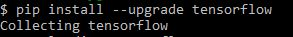

# Module_13_Challenge: Venture Funding with Deep Learning
This application uses neural networks to create a model that predicts whether applicants will be successful if funded.

---

## Technologies

This was run on a pc using Windows 10

This project leverages python 3.8.8 with the following packages:

* [pandas](https://pandas.pydata.org/docs) - For manipulating the DataFrame.

* [Jupyter Lab](https://jupyterlab.readthedocs.io.en/stable) - For code and visualizations.

* [pathlib](https://docs.python.org/3/library/pathlib.html) - For location through the directory and file path.

* [Tensorflow](https://www.tensorflow.org/api_docs) - For developing and training models.

* [Dense](https://www.tensorflow.org/api_docs/python/tf/keras/layers/Dense) - For a densely-connected neural network layer.

* [Sequential](https://www.tensorflow.org/guide/keras/sequential_model) - For a plain stack with one input and one output.

* [Train test split](https://scikit-learn.org/stable/modules/generated/sklearn.model_selection.train_test_split.html) - For splitting arrays into random train and test subsets.

* [Standardscaler](https://scikit-learn.org/stable/modules/generated/sklearn.preprocessing.StandardScaler.html) - For standardizing features by removing themean and scaling to unit variance.

* [OneHotEncoder](https://scikit-learn.org/stable/modules/generated/sklearn.preprocessing.OneHotEncoder.html) - For encoding categorical features as a one-hot numeric array.

---

## Installation Guide

In gitbash after you have activated your dev environment, install the following:

*Jupyter Lab

    `pip install jupyter lab`
    

*Tensorflow

    `pip install --upgrade tensorflow`
    

*Check Tensorflow and Keras

    `python -c "import tensorflow as tf;print(tf.__version__)"`
    `python -c "import tensorflow as tf;print(tf.keras.__version__)"
    

---

## Examples

The images below show the different types of dataframes and outputs that should be a result from running the code in the Venture Funding application.

---

## Contributors

Andrew McKay

Email: andrew.v.mckay@gmail.com

---